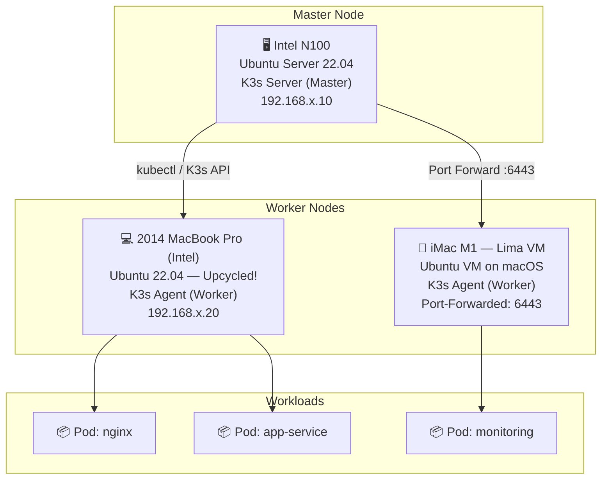

# Hybrid-K3s-Cluster
다양한 하드웨어 자원(Intel N100, N5095, MacBook Pro(Intel), iMac(Lima VM))을 활용하여 구축한 하이브리드 쿠버네티스(K3s) 클러스터 구축 및 운영 기록입니다.

## 목차

| 순서 | 제목 | 설명 |
|------|------|------|
| 01 | [N100 미니PC를 서버로 만들기](docs/01-n100-서버-셋업.md) | Ubuntu Server 설치, 고정 IP, SSH 키 인증, 방화벽 설정 |
| 02 | [Docker 설치 및 텔레그램 봇 만들기](docs/02-docker-설치-및-텔레그램-봇.md) | Docker 설치, Python 텔레그램 봇 컨테이너로 운영 |
# KEUN-Server-Federation: Hybrid K3s Cluster

> *"Old hardware deserves a second life. Linux can be learned. And a cluster can be built from scratch."*

다양한 하드웨어 자원(Intel N100, 2014 MacBook Pro, iMac M1 via Lima VM)을 활용하여 구축한 하이브리드 쿠버네티스(K3s) 클러스터의 구축 및 운영 기록입니다.

---

## 🗺️ Architecture Overview



---

## 📖 The Story Behind This Project

### 1. 🐧 My First Linux Step
Everything started with an **Intel N100 mini-PC** and zero Linux experience.

- Flashed Ubuntu Server 22.04 onto a USB drive, installed it on the N100.
- Learned core CLI commands from scratch: `ls`, `cd`, `sudo`, `nano`, `systemctl`, `ip a`, `ssh`.
- Configured a static IP address, enabled SSH, and took my first steps into the world of server administration.

This machine became the **K3s master node** — the brain of the entire cluster.

---

### 2. ♻️ Hardware Upcycling: Reviving a 2014 MacBook Pro
Instead of buying new hardware, I gave a **10-year-old 2014 MacBook Pro** a brand-new purpose.

- macOS was no longer receiving updates on this machine — it was essentially retired.
- Installed Ubuntu 22.04 LTS, wiping macOS entirely.
- Resolved several hardware-specific challenges: Wi-Fi driver (Broadcom BCM4360, `bcmwl-kernel-source`), display brightness, and keyboard mapping.
- Joined it to the K3s cluster as a **dedicated worker node**.

> 💡 **Upcycling Impact**: Instead of e-waste, this machine now runs production workloads in a Kubernetes cluster.

See the full installation guide: [`scripts/setup/mbp-2014-ubuntu-setup.sh`](scripts/setup/mbp-2014-ubuntu-setup.sh)

---

### 3. 🍎 Modern Virtualization: iMac M1 + Lima VM
To integrate my daily-driver **iMac M1** (Apple Silicon) into the cluster without dual-booting:

- Installed [Lima](https://lima-vm.io/) — a lightweight Linux VM manager for macOS.
- Created an Ubuntu 22.04 VM via Lima, configured with sufficient CPU and RAM.
- Installed K3s agent inside the Lima VM and connected it to the N100 master.
- Used Lima's port-forwarding capability to expose the necessary ports to the host macOS network.

---

### 4. 🔧 Troubleshooting Masterclass: Solving "Connection Refused"

**Problem**: The K3s agent inside Lima VM could not reach the K3s master on the N100.

```
FATA[0000] starting kubernetes: connecting to server: dial tcp 192.168.x.10:6443: connect: connection refused
```

**Root Cause Analysis**:

| Factor | Detail |
|--------|--------|
| Lima Network Mode | NAT (default) — the VM is behind a virtual NAT, not directly on the LAN |
| K3s API Port | `6443` on the N100 master |
| Symptom | Lima VM's outbound IP was the *macOS host IP*, not a routable cluster IP |

**Solution: Explicit Port Forwarding in Lima config**

1. Edit the Lima VM configuration file (`~/.lima/<vm-name>/lima.yaml`):

```yaml
portForwards:
  - guestPort: 6443
    hostPort: 6443
    hostIP: "0.0.0.0"
```

2. Restart the Lima VM:

```bash
limactl stop <vm-name>
limactl start <vm-name>
```

3. On the **N100 master**, confirm K3s is listening on all interfaces:

```bash
sudo netstat -tlnp | grep 6443
# Expected: tcp6  0  0 :::6443  :::*  LISTEN
```

4. Re-register the K3s agent inside Lima:

```bash
curl -sfL https://get.k3s.io | K3S_URL=https://<N100-IP>:6443 K3S_TOKEN=<node-token> sh -
```

**Result**: ✅ Agent connected successfully. All nodes showing `Ready` status.

```bash
kubectl get nodes
# NAME          STATUS   ROLES                  AGE
# n100          Ready    control-plane,master   5d
# mbp-2014      Ready    <none>                 3d
# lima-worker   Ready    <none>                 1d
```

---

## 📁 Repository Structure

```
KEUN-Server-Federation/
├── README.md                          # This file — full project narrative
├── .gitignore                         # Protects tokens and sensitive data
├── manifests/                         # Kubernetes YAML manifests
│   ├── namespace.yaml
│   ├── nginx-deployment.yaml
│   └── monitoring/
│       └── node-exporter-daemonset.yaml
└── scripts/
    └── setup/
        └── mbp-2014-ubuntu-setup.sh   # Ubuntu setup script for 2014 MacBook Pro
```

---

## 🚀 Quick Start

### Prerequisites
- K3s master node running (Intel N100 recommended)
- Target worker node with Ubuntu 22.04 installed
- `kubectl` configured on your local machine

### Join a Worker Node

```bash
# On the master node — retrieve the join token
sudo cat /var/lib/rancher/k3s/server/node-token

# On the worker node — join the cluster
curl -sfL https://get.k3s.io | \
  K3S_URL=https://<MASTER_IP>:6443 \
  K3S_TOKEN=<NODE_TOKEN> \
  sh -
```

### Apply Manifests

```bash
kubectl apply -f manifests/namespace.yaml
kubectl apply -f manifests/nginx-deployment.yaml
kubectl apply -f manifests/monitoring/
```

---

## 🖥️ Hardware Specs

| Node | Hardware | OS | Role |
|------|----------|----|------|
| `n100-master` | Intel N100 Mini-PC (4C/4T, 16GB RAM) | Ubuntu Server 22.04 | Control Plane |
| `mbp-2014-worker` | MacBook Pro 13" 2014 (i5, 8GB RAM) | Ubuntu 22.04 LTS | Worker Node |
| `lima-worker` | iMac M1 → Lima VM (4 vCPU, 8GB vRAM) | Ubuntu 22.04 (VM) | Worker Node |

---

## 📝 Lessons Learned

- **Linux is learnable** — starting with zero experience and building a working cluster proves that documentation and persistence matter more than prior knowledge.
- **Old hardware is not dead hardware** — a 10-year-old MacBook Pro can serve production Kubernetes workloads with Ubuntu installed.
- **Networking is the hardest part** — NAT, port forwarding, and firewall rules are where most cluster-join failures originate. Always check connectivity first.
- **K3s lowers the barrier** — compared to full Kubernetes, K3s's lightweight footprint makes home-lab clustering genuinely accessible.

---

## 📜 License

MIT License — feel free to fork, adapt, and build your own server federation.
