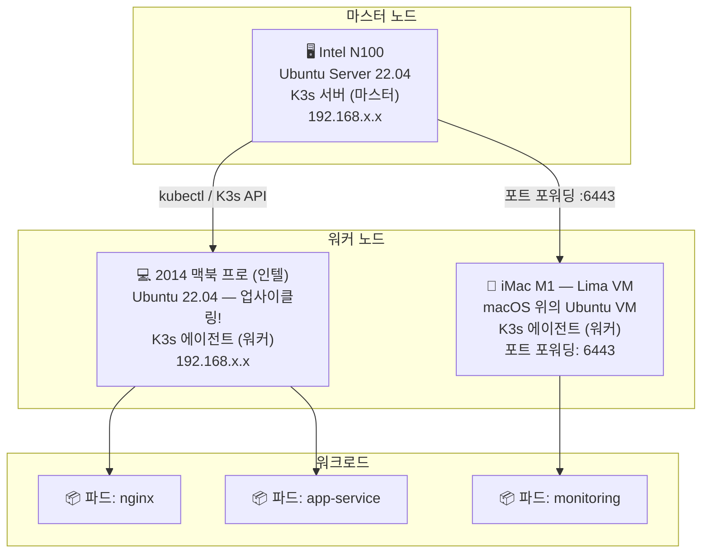

# Hybrid-K3s-Cluster
다양한 하드웨어 자원(Intel N100, N5095, MacBook Pro(Intel), iMac(Lima VM))을 활용하여 구축한 하이브리드 쿠버네티스(K3s) 클러스터 구축 및 운영 기록입니다.

## 목차

| 순서 | 제목 | 설명 |
|------|------|------|
| 01 | [N100 미니PC를 서버로 만들기](docs/01-n100-서버-셋업.md) | Ubuntu 설치, 고정 IP, SSH 키 인증, 방화벽 설정 |
| 02 | [Docker 설치 및 텔레그램 봇 만들기](docs/02-docker-설치-및-텔레그램-봇.md) | Docker 설치, Python 텔레그램 봇 컨테이너로 운영 |
| 03 | [맥북프로 2014에 우분투 설치하기](docs/03-맥북프로2014-우분투-설치.md) | 인텔 맥에 Ubuntu 22.04 설치, Wi-Fi 드라이버, K3s 워커 노드 준비 |
| 04 | [아이맥(iMac M1) + Lima로 K3s 워커 노드 구성](docs/04-아이맥-lima-설치.md) | Lima 설치, Ubuntu VM 생성, 포트 포워딩, K3s 에이전트 연결 |
| 05 | [맥북에어에서 외부 원격으로 서버 관리하기](docs/05-맥북에어-원격-관리.md) | 고정 IP + 포트포워딩, SSH 설정, kubectl 원격 접속, 맥북에어 관리 워크스테이션 구성 |
# KEUN-Server-Federation: 하이브리드 K3s 클러스터

> *"오래된 하드웨어도 새로운 삶을 누릴 수 있다. 리눅스는 배울 수 있다. 그리고 클러스터는 처음부터 직접 만들 수 있다."*

다양한 하드웨어 자원(Intel N100, 2014 맥북 프로, Lima VM을 활용한 iMac M1)을 활용하여 구축한 하이브리드 쿠버네티스(K3s) 클러스터의 구축 및 운영 기록입니다.

---

## 🗺️ 아키텍처 개요



---

## 📖 프로젝트 배경 이야기

### 1. 🐧 나의 첫 번째 리눅스 도전
모든 것은 **Intel N100 미니PC** 한 대와 리눅스 경험 제로에서 시작되었습니다.

- Ubuntu Server 22.04를 USB 드라이브에 구워 N100에 설치했습니다.
- `ls`, `cd`, `sudo`, `nano`, `systemctl`, `ip a`, `ssh` 등 핵심 CLI 명령어를 처음부터 익혔습니다.
- 고정 IP 주소를 설정하고, SSH를 활성화하며 서버 관리의 세계에 첫발을 내디뎠습니다.

이 머신이 전체 클러스터의 두뇌인 **K3s 마스터 노드**가 되었습니다.

---

### 2. ♻️ 하드웨어 업사이클링: 2014 맥북 프로에 새 생명을
새 하드웨어를 구입하는 대신, **10년 된 2014 맥북 프로**에 새로운 역할을 부여했습니다.

- 이 기기는 더 이상 macOS 업데이트를 받지 못해 사실상 은퇴 상태였습니다.
- macOS를 완전히 지우고 Ubuntu 22.04 LTS를 설치했습니다.
- Wi-Fi 드라이버(Broadcom BCM4360, `bcmwl-kernel-source`), 화면 밝기, 키보드 매핑 등 하드웨어 특이 문제들을 해결했습니다.
- K3s 클러스터의 **전용 워커 노드**로 합류시켰습니다.

> 💡 **업사이클링 효과**: 전자 폐기물이 될 뻔한 이 기기가 이제 쿠버네티스 클러스터에서 프로덕션 워크로드를 실행하고 있습니다.

전체 설치 가이드: [`scripts/setup/mbp-2014-ubuntu-setup.sh`](scripts/setup/mbp-2014-ubuntu-setup.sh)

---

### 3. 🍎 최신 가상화: iMac M1 + Lima VM
듀얼 부팅 없이 평소 사용하는 **iMac M1**(Apple Silicon)을 클러스터에 통합하기 위해:

- [Lima](https://lima-vm.io/)를 설치했습니다 — macOS용 경량 Linux VM 관리자입니다.
- Lima를 통해 Ubuntu 22.04 VM을 생성하고, 충분한 CPU와 RAM으로 구성했습니다.
- Lima VM 내부에 K3s 에이전트를 설치하고 N100 마스터에 연결했습니다.
- Lima의 포트 포워딩 기능을 활용해 필요한 포트를 호스트 macOS 네트워크에 노출했습니다.

---

### 4. 🔧 트러블슈팅 심화: "Connection Refused" 문제 해결

**문제**: Lima VM 내부의 K3s 에이전트가 N100의 K3s 마스터에 접근하지 못했습니다.

```
FATA[0000] starting kubernetes: connecting to server: dial tcp 192.168.x.10:6443: connect: connection refused
```

**원인 분석**:

| 요인 | 상세 내용 |
|------|-----------|
| Lima 네트워크 모드 | NAT (기본값) — VM이 가상 NAT 뒤에 있어 LAN에 직접 연결되지 않음 |
| K3s API 포트 | N100 마스터의 `6443` 포트 |
| 증상 | Lima VM의 아웃바운드 IP가 라우팅 가능한 클러스터 IP가 아닌 *macOS 호스트 IP*였음 |

**해결 방법: Lima 설정에서 명시적 포트 포워딩 설정**

1. Lima VM 설정 파일 수정 (`~/.lima/<vm-이름>/lima.yaml`):

```yaml
portForwards:
  - guestPort: 6443
    hostPort: 6443
    hostIP: "0.0.0.0"
```

2. Lima VM 재시작:

```bash
limactl stop <vm-이름>
limactl start <vm-이름>
```

3. **N100 마스터**에서 K3s가 모든 인터페이스에서 수신 대기 중인지 확인:

```bash
sudo netstat -tlnp | grep 6443
# 예상 출력: tcp6  0  0 :::6443  :::*  LISTEN
```

4. Lima 내부에서 K3s 에이전트 재등록:

```bash
curl -sfL https://get.k3s.io | K3S_URL=https://<N100-IP>:6443 K3S_TOKEN=<노드-토큰> sh -
```

**결과**: ✅ 에이전트 연결 성공. 모든 노드가 `Ready` 상태로 표시됩니다.

```bash
kubectl get nodes
# NAME          STATUS   ROLES                  AGE
# n100          Ready    control-plane,master   5d
# mbp-2014      Ready    <none>                 3d
# lima-worker   Ready    <none>                 1d
```

---

## 📁 저장소 구조

```
KEUN-Server-Federation/
├── README.md                          # 이 파일 — 전체 프로젝트 설명
├── .gitignore                         # 토큰 및 민감한 데이터 보호
├── docs/                              # 단계별 설치 및 운영 가이드
│   ├── 01-n100-서버-셋업.md
│   ├── 02-docker-설치-및-텔레그램-봇.md
│   ├── 03-맥북프로2014-우분투-설치.md
│   ├── 04-아이맥-lima-설치.md
│   └── 05-맥북에어-원격-관리.md       # 고정 IP + 포트포워딩, 원격 SSH/kubectl 설정
├── manifests/                         # 쿠버네티스 YAML 매니페스트
│   ├── namespace.yaml
│   ├── nginx-deployment.yaml
│   └── monitoring/
│       └── node-exporter-daemonset.yaml
└── scripts/
    └── setup/
        ├── mbp-2014-ubuntu-setup.sh        # 2014 맥북 프로용 Ubuntu 설정 스크립트
        ├── lima-ubuntu-k3s.yaml            # Lima VM 템플릿 (Ubuntu 22.04, 4vCPU, 8GiB)
        ├── lima-k3s-setup.sh               # macOS 호스트 스크립트 — Lima 설치 + K3s 에이전트 클러스터 참여
        ├── ssh-port-forward-setup.sh       # 서버용 SSH 원격 접속 설정 스크립트 (고정 IP + 포트포워딩)
        └── macbook-air-remote-setup.sh     # 맥북에어 원격 관리 환경 설정 스크립트
```

---

## 🚀 빠른 시작

### 사전 요구사항
- K3s 마스터 노드 실행 중 (Intel N100 권장)
- Ubuntu 22.04가 설치된 워커 노드
- 로컬 머신에 `kubectl` 설정 완료

### 워커 노드 참여

```bash
# 마스터 노드에서 — 참여 토큰 조회
sudo cat /var/lib/rancher/k3s/server/node-token

# 워커 노드에서 — 클러스터 참여
curl -sfL https://get.k3s.io | \
  K3S_URL=https://<마스터_IP>:6443 \
  K3S_TOKEN=<노드_토큰> \
  sh -
```

### 매니페스트 적용

```bash
kubectl apply -f manifests/namespace.yaml
kubectl apply -f manifests/nginx-deployment.yaml
kubectl apply -f manifests/monitoring/
```

---

## 🖥️ 하드웨어 사양

| 노드 | 하드웨어 | 운영체제 | 역할 |
|------|----------|----------|------|
| `n100-master` | Intel N100 미니PC (4코어/4스레드, 16GB RAM) | Ubuntu Server 22.04 | 컨트롤 플레인 |
| `mbp-2014-worker` | 맥북 프로 13" 2014 (i5, 8GB RAM) | Ubuntu 22.04 LTS | 워커 노드 |
| `lima-worker` | iMac M1 → Lima VM (4 vCPU, 8GB vRAM) | Ubuntu 22.04 (VM) | 워커 노드 |

---

## 📝 배운 점

- **리눅스는 배울 수 있다** — 경험 없이 시작해서 작동하는 클러스터를 구축하는 과정은, 사전 지식보다 문서화와 끈기가 더 중요하다는 것을 증명합니다.
- **오래된 하드웨어는 죽지 않는다** — 10년 된 맥북 프로도 Ubuntu를 설치하면 프로덕션 쿠버네티스 워크로드를 처리할 수 있습니다.
- **네트워킹이 가장 어렵다** — NAT, 포트 포워딩, 방화벽 규칙이 대부분의 클러스터 참여 실패의 원인입니다. 항상 연결성부터 확인하세요.
- **K3s는 진입 장벽을 낮춘다** — 풀 쿠버네티스에 비해 K3s의 경량 구조는 홈랩 클러스터링을 진정으로 접근 가능하게 만들어 줍니다.

---

## 📜 라이선스

MIT 라이선스 — 자유롭게 포크하고, 수정하고, 나만의 서버 연합을 구축하세요.
